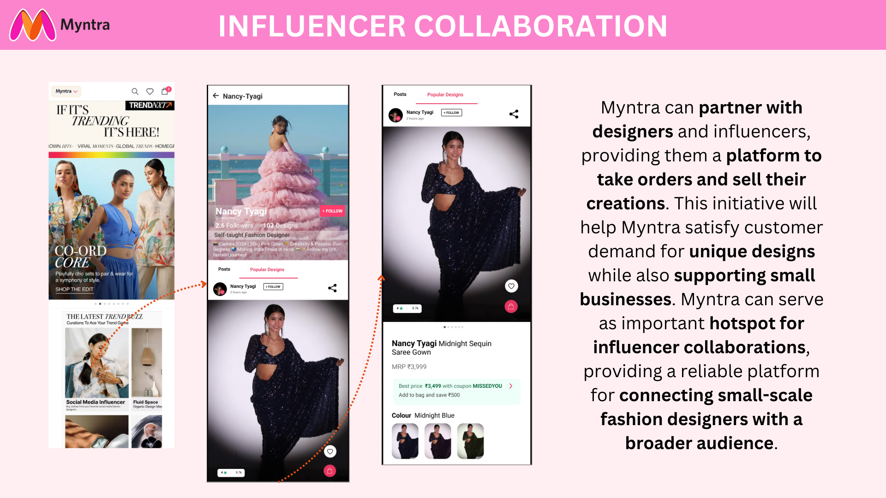

# Myntra Marketing Initiatives

## Overview
This repository contains ideas and visual concepts for enhancing Myntra's marketing strategies through influencer collaboration and affiliate marketing. These initiatives aim to support small-scale designers, enhance customer shopping experiences, and drive traffic from social media platforms to Myntra.

## Initiatives

### 1. Influencer Collaboration
Small-scale fashion designers, such as Nancy Tyagi, who are well-known on social media platforms like Instagram and YouTube, often lacked a large following in their initial career days. These designers offer unique and highly sought-after designs. Myntra can partner with these designers and influencers, providing them a platform to take orders and sell their creations. This initiative will help Myntra satisfy customer demand for unique designs while also supporting small businesses.

**Key Benefits:**
- Provides a platform for small-scale designers to reach a broader audience.
- Helps Myntra offer unique and exclusive designs to its customers.
- Supports small businesses and promotes creative talent.

**Visual Concept:**

**Prototype:**
[Influencer Collaboration Prototype on Figma](https://www.figma.com/proto/i6DeqlGvWJnX0Vr6ZmXQb4/Myntra-WeForShe?node-id=62-2&t=lt17DoVg1Xhval0p-1&scaling=scale-down&content-scaling=fixed&page-id=0%3A1&starting-point-node-id=62%3A2)

### 2. Affiliate Marketing
Users can post pictures of themselves styled in the clothes they bought from Myntra on Instagram, along with links to the products. They will earn points for each purchase made through their link, which can be used to avail benefits. This seamless integration of social media and shopping enhances the user experience and drives traffic to Myntra.

**Key Benefits:**
- Encourages user-generated content and word-of-mouth marketing.
- Streamlines the purchasing process, making it easier for customers to buy what they see on social media.
- Rewards users for driving sales, fostering a loyal customer base.

**Visual Concept:**

## Conclusion
These marketing strategies are designed to enhance Myntra's brand presence on social media, support emerging designers, and improve the overall shopping experience for customers. By leveraging the power of influencer collaboration and affiliate marketing, Myntra can create a more engaging and dynamic platform for fashion enthusiasts.
